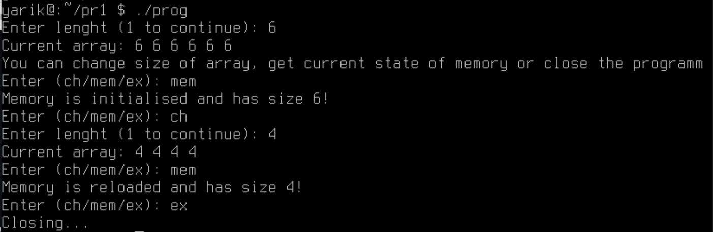

# Завдання варіанту 13

## Умова завдання

Напишіть програму, яка читає число та створює динамічний масив цього розміру.
1. Заповніть масив цим числом.
2. Додайте функцію зміни розміру масиву (realloc) та реалізуйте можливість збільшення чи зменшення розміру масиву під час виконання програми.
3. Введіть обмеження на мінімальний та максимальний розмір масиву.
4. Реалізуйте функцію перевірки використання пам’яті, яка виводить поточний стан виділеної пам’яті (malloc, realloc, free).

## [Код до програми](task1-13.c)

## Результати

