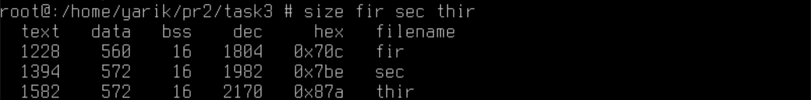

# Завдання 1

## Умова завдання

Напишіть програму для визначення моменту, коли time_t закінчиться. Дослідіть, які зміни відбуваються в залежності від 32- та 64-бітної архітектури. Дослідіть сегменти виконуваного файлу.

## [Код до програми](task1/programm.c)

## Результати


# Завдання 2

## Умова завдання

Розгляньте сегменти у виконуваному файлі.
1. Скомпілюйте програму "hello world", запустіть ls -l для виконуваного файлу, щоб отримати його загальний розмір, і запустіть size, щоб отримати розміри сегментів всередині нього.
2. Додайте оголошення глобального масиву із 1000 int, перекомпілюйте й повторіть вимірювання. Зверніть увагу на відмінності.
3. Тепер додайте початкове значення в оголошення масиву (пам’ятайте, що C не змушує вас вказувати значення для кожного елемента масиву в ініціалізаторі). Це перемістить масив із сегмента BSS у сегмент даних. Повторіть вимірювання. Зверніть увагу на різницю.
4. Тепер додайте оголошення великого масиву в локальну функцію. Оголосіть другий великий локальний масив з ініціалізатором. Повторіть вимірювання. Дані розташовуються всередині функцій, залишаючись у виконуваному файлі? Яка різниця, якщо масив ініціалізований чи ні?
5. Які зміни відбуваються з розмірами файлів і сегментів, якщо ви компілюєте для налагодження? Для максимальної оптимізації?

Проаналізуйте результати, щоб переконатися, що:
  1. сегмент даних зберігається у виконуваному файлі;
  2. сегмент BSS не зберігається у виконуваному файлі (за винятком примітки щодо його вимог до розміру часу виконання);
  3. текстовий сегмент більшою мірою піддається перевіркам оптимізації;
  4. на розмір файлу a.out впливає компіляція для налагодження, але не сегменти.

## Частинна 1

### Умова

Скомпілюйте програму "hello world", запустіть ls -l для виконуваного файлу, щоб отримати його загальний розмір, і запустіть size, щоб отримати розміри сегментів всередині нього.

### [Код до програми](task2/z1.c)

### Результати

[Розмір всіх файлів](task2/all-sizes.png)


## Частина 2

### Умова

Додайте оголошення глобального масиву із 1000 int, перекомпілюйте й повторіть вимірювання. Зверніть увагу на відмінності.

### [Код до програми](task2/z2.c)

### Результати

[Розмір всіх файлів](task2/all-sizes.png)


## Частина 3

### Умова

Тепер додайте початкове значення в оголошення масиву (пам’ятайте, що C не змушує вас вказувати значення для кожного елемента масиву в ініціалізаторі). Це перемістить масив із сегмента BSS у сегмент даних. Повторіть вимірювання. Зверніть увагу на різницю.

### [Код до програми](task2/z3.c)

### Результати

[Розмір всіх файлів](task2/all-sizes.png)


## Частина 4

### Умова

Тепер додайте оголошення великого масиву в локальну функцію. Оголосіть другий великий локальний масив з ініціалізатором. Повторіть вимірювання. Дані розташовуються всередині функцій, залишаючись у виконуваному файлі? Яка різниця, якщо масив ініціалізований чи ні?

## Відповідь

Дані, які були ініціалізовані у функції зберігаються у файлі. Коли масив пустий, він не зберігається у сегменті даних, а коли ініціалізований -- зберігається.

### [Код до програми з ініціалізованим масивом](task2/z4-in.c)
### [Код до програми не з ініціалізованим масивом](task2/z4-un.c)

### Результати

[Розмір всіх файлів](task2/all-sizes.png)


## Частина 5

### Умова

Які зміни відбуваються з розмірами файлів і сегментів, якщо ви компілюєте для налагодження? Для максимальної оптимізації?

### [Код до програми з ініціалізованим масивом](task2/z4-in.c)
### [Код до програми не з ініціалізованим масивом](task2/z4-un.c)

### Результати

[Розмір всіх файлів](task2/all-sizes.png)


# Завдання 3

## Умова завдання

Скомпілюйте й запустіть тестову програму, щоб визначити приблизне розташування стека у вашій системі:

```
#include <stdio.h>
int main() {
    int i;
    printf("The stack top is near %p\n", &i);
    return 0;
}
```

Знайдіть розташування сегментів даних і тексту, а також купи всередині сегмента даних, оголосіть змінні, які будуть поміщені в ці сегменти, і виведіть їхні адреси. Збільшіть розмір стека, викликавши функцію й оголосивши кілька великих локальних масивів. Яка зараз адреса вершини стека?

Примітка: стек може розташовуватися за різними адресами на різних архітектурах та різних ОС. Хоча ми говоримо про вершину стека, на більшості процесорів стек зростає вниз, до пам’яті з меншими значеннями адрес.

## [Код до програми умови 1](task3/condition-1.c)
## [Код до програми умови 2](task3/condition-2.c)
## [Код до програми умови 3](task3/condition-3.c)

## Результати





# Завдання 4

## Умова завдання

Ваше завдання – дослідити стек процесу або пригадати, як це робиться. Ви можете:
- Автоматично за допомогою утиліти gstack.
- Вручну за допомогою налагоджувача GDB.

Користувачі Ubuntu можуть зіткнутися з проблемою: на момент написання (Ubuntu 18.04) gstack, схоже, не був доступний (альтернативою може бути pstack). Якщо gstack не працює, використовуйте другий метод - через GDB, як показано нижче.

## [Код до програми](task4/programm.c)

## Результати


# Завдання 5

## Умова завдання

Відомо, що при виклику процедур і поверненні з них процесор використовує стек. Чи можна в такій схемі обійтися без лічильника команд (IP), використовуючи замість нього вершину стека? Обґрунтуйте свою відповідь та наведіть приклади.

## Відповідь

Ні, не можна. Стек зберігає все, що звʼязано з функціями, наприклад: адреси повернення, локальні дані, аргументи. Лічильник команд вказує на поточну та наступну інструкцію. Тому виходить, що лічильник команд працює постійно, змінюючи свої значення при переході на наступну інструкцію, а стек зберігає тимчасові дані, повʼязані з функціями. Тому лічильник команд (IP) не можна замінити стеком, оскільки вони виконують різні функції.

# Завдання варіанту 13

## Умова завдання

Дослідіть вплив оптимізації -Os на розмір сегментів.

## [Код до програми](self-task/programm.c)

## Результати


