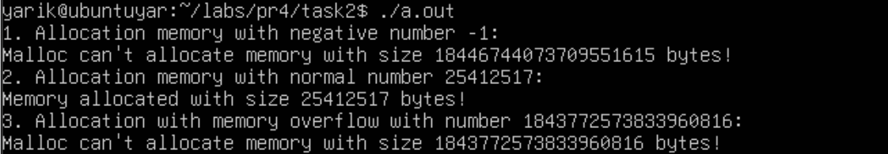

# Завдання 1

## Умова завдання

Скільки пам’яті може виділити malloc(3) за один виклик?

Параметр malloc(3) є цілим числом типу даних size_t, тому логічно максимальне число, яке можна передати як параметр malloc(3), — це максимальне значення size_t на платформі (sizeof(size_t)). У 64-бітній Linux size_t становить 8 байтів, тобто 8 * 8 = 64 біти. Відповідно, максимальний обсяг пам’яті, який може бути виділений за один виклик malloc(3), дорівнює 2^64. Спробуйте запустити код на x86_64 та x86. Чому теоретично максимальний обсяг складає 8 ексабайт, а не 16?

## [Код до програми](task1/prog.c)

## Результати


# Завдання 2

## Умова завдання

Що станеться, якщо передати malloc(3) від’ємний аргумент? Напишіть тестовий випадок, який обчислює кількість виділених байтів за формулою num = xa * xb. Що буде, якщо num оголошене як цілочисельна змінна зі знаком, а результат множення призведе до переповнення? Як себе поведе malloc(3)? Запустіть програму на x86_64 і x86.

## [Код до програми](task2/prog.c)

## Результати




# Завдання 3

## Умова завдання

Що станеться, якщо використати malloc(0)? Напишіть тестовий випадок, у якому malloc(3) повертає NULL або вказівник, що не є NULL, і який можна передати у free(). Відкомпілюйте та запустіть через ltrace. Поясніть поведінку програми.

## [Код до програми](task3/prog.c)

## Результати


# Завдання 4

## Умова завдання

Чи є помилки у такому коді?

```
void *ptr = NULL;
while (<some-condition-is-true>) {
    if (!ptr)
        ptr = malloc(n);
    [... <використання 'ptr'> ...]
    free(ptr);
}
```

Напишіть тестовий випадок, який продемонструє проблему та правильний варіант коду.

## [Код не правильної програми](task4/prog-incorr.c)
## [Код правильної програми](task4/prog-corr.c)

## Результати


# Завдання 5

## Умова завдання

Що станеться, якщо realloc(3) не зможе виділити пам’ять? Напишіть тестовий випадок, що демонструє цей сценарій.

## [Код до програми](task5/prog.c)

## Результати


# Завдання 6

## Умова завдання

Якщо realloc(3) викликати з NULL або розміром 0, що станеться? Напишіть тестовий випадок.

## [Код до програми](task6/prog.c)

## Результати


# Завдання 7

## Умова завдання

Перепишіть наступний код, використовуючи reallocarray(3):

```
struct sbar *ptr, *newptr;
ptr = calloc(1000, sizeof(struct sbar));
newptr = realloc(ptr, 500*sizeof(struct sbar));
```

Порівняйте результати виконання з використанням ltrace.

## [Код до програми](task7/prog.c)

## Результати


# Завдання варіанту 13

## Умова завдання

Використайте mallopt() для налаштування malloc та перевірте ефект.

## Виконання
Це завдання я не виконав, оскільки не зміг дослідити вплив ключів mallopt() на malloc чи розподілення памʼяті. Я намагався дослідити mallopt() за такими ключами: M_CHECK_ACTION, M_MXFAST та M_TRIM_THRESHOLD, але ніяких змін не помітив.

## [Код до програми](self-task/prog.c)

## Результати

