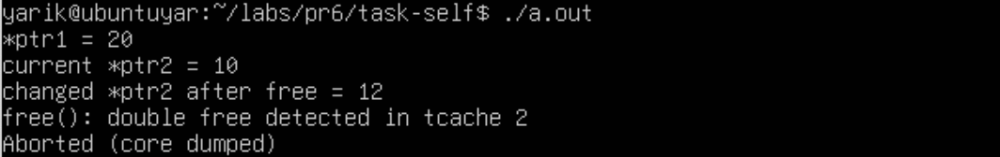

# Завдання варіанту 13

## Умова завдання

Напишіть сценарій, що виконує всі test cases під Valgrind та створює звіт по кожному з них.

## [Код до програми](task1-13.c)

## Результати

### [Звіт Vallgrind](vallgrind-log.txt)
