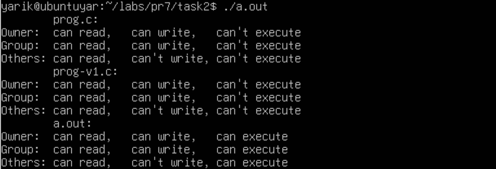
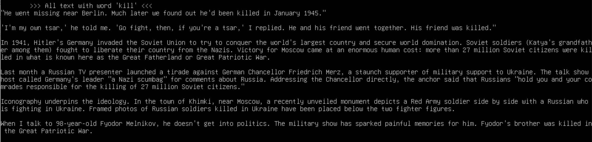

# Завдання 1

## Умова завдання

Використайте popen(), щоб передати вивід команди rwho (команда UNIX) до more (команда UNIX) у програмі на C.

## [Код до програми](task1/programm.c)

## Результати

# Завдання 2

## Умова завдання

Напишіть програму мовою C, яка імітує команду ls -l в UNIX — виводить список усіх файлів у поточному каталозі та перелічує права доступу тощо.
(Варіант вирішення, що просто виконує ls -l із вашої програми, — не підходить).

## [Код до програми](task2/programm.c)

## Результати

# Завдання 3

## Умова завдання

Напишіть програму, яка друкує рядки з файлу, що містять слово, передане як аргумент програми (проста версія утиліти grep в UNIX).

## [Код до програми](task3/programm.c)

## Результати

# Завдання 4

## Умова завдання

Напишіть програму, яка виводить список файлів, заданих у вигляді аргументів, з зупинкою кожні 20 рядків, доки не буде натиснута клавіша (спрощена версія утиліти more в UNIX).

## [Код до програми](task4/programm.c)

## Результати

# Завдання 5

## Умова завдання

Напишіть програму, яка перелічує всі файли в поточному каталозі та всі файли в підкаталогах.

## [Код до програми](task5/programm.c)

## Результати

# Завдання 6

## Умова завдання

Напишіть програму, яка перелічує лише підкаталоги у алфавітному порядку.

## [Код до програми](task6/programm.c)

## Результати

# Завдання 7

## Умова завдання

Напишіть програму, яка показує користувачу всі його/її вихідні програми на C, а потім в інтерактивному режимі запитує, чи потрібно надати іншим дозвіл на читання (read permission); у разі ствердної відповіді — такий дозвіл повинен бути наданий.

## [Код до програми](task7/programm.c)

## Результати

# Завдання 8

## Умова завдання

Напишіть програму, яка надає користувачу можливість видалити будь-який або всі файли у поточному робочому каталозі. Має з’являтися ім’я файлу з запитом, чи слід його видалити.

## [Код до програми](task8/programm.c)

## Результати

# Завдання 9

## Умова завдання

Напишіть програму на C, яка вимірює час виконання фрагмента коду в мілісекундах.

## [Код до програми](task9/programm.c)

## Результати

# Завдання 10

## Умова завдання

Напишіть програму мовою C для створення послідовності випадкових чисел з плаваючою комою у діапазонах:
    (a) від 0.0 до 1.0
    (b) від 0.0 до n, де n — будь-яке дійсне число з плаваючою точкою.
    Початкове значення генератора випадкових чисел має бути встановлене так, щоб гарантувати унікальну послідовність.
Примітка: використання прапорця -Wall під час компіляції є обов’язковим.

## [Код до програми](task10/programm.c)

## Результати

# Завдання варіанту 13

## Умова завдання

Напишіть утиліту, яка визначає "аномальні" виконувані файли в системі.

## [Код до програми](self-task/programm.c)

## Результати

