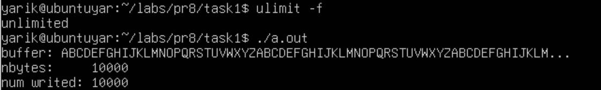
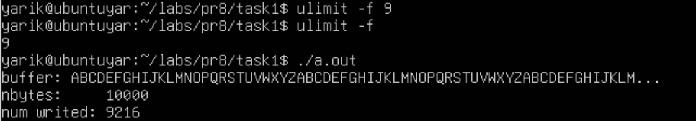
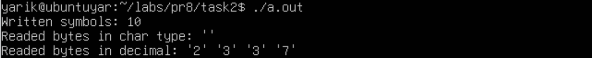
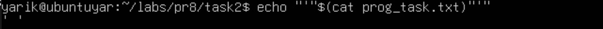
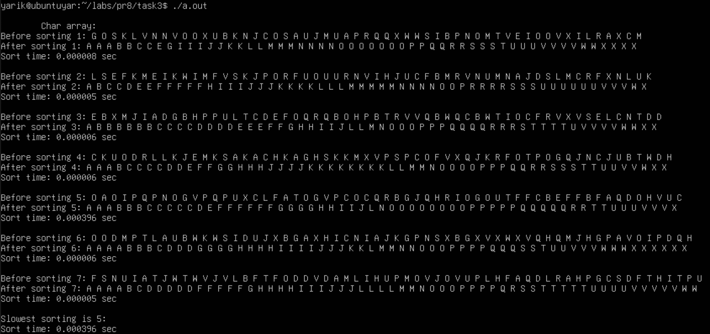
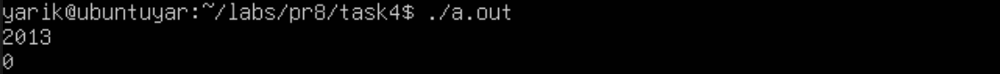
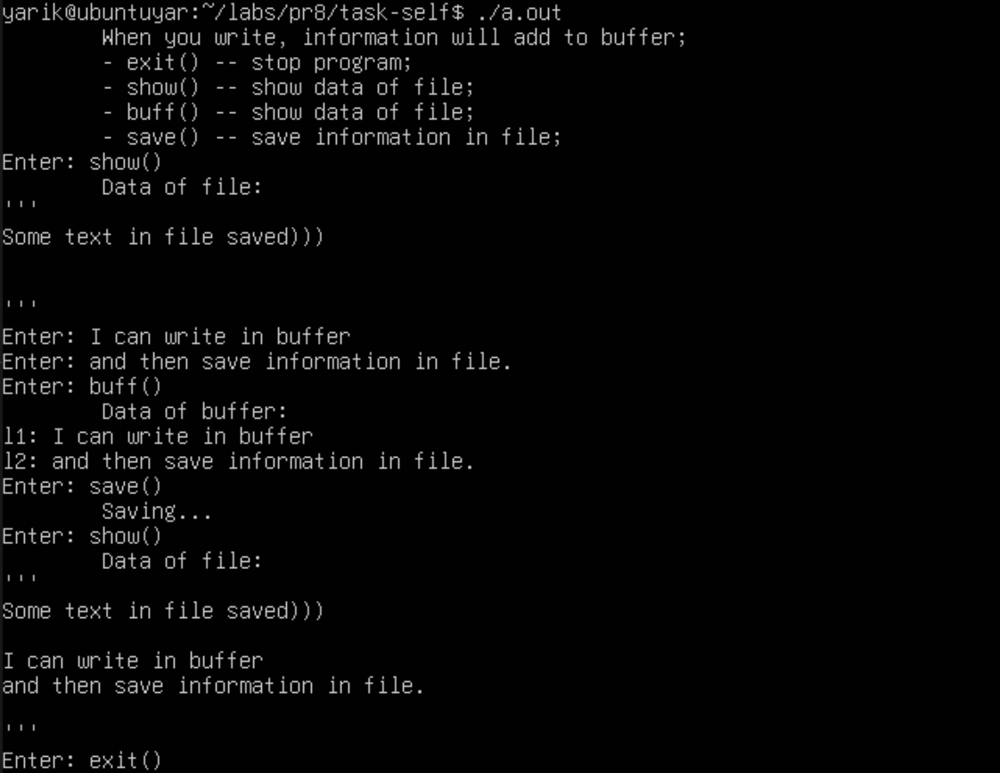

# Завдання 1

## Умова завдання

Чи може виклик count = write(fd, buffer, nbytes); повернути в змінній count значення, відмінне від nbytes? Якщо так, то чому? Наведіть робочий приклад програми, яка демонструє вашу відповідь.

## [Код до програми](task1/programm.c)
## [Файл до програми](task1/prog_task.txt)

## Результати




## Відповідь на питання
Чи може виклик count = write(fd, buffer, nbytes); повернути в змінній count значення, відмінне від nbytes? Якщо так, то чому?

Так, може. В цій програмі я обмежив розмір для файлів до 9 Кб, тому write() фізично не може записати 10000 байтів і повертає кількість байтів, які були успішно записані.

# Завдання 2

## Умова завдання

Є файл, дескриптор якого — fd. Файл містить таку послідовність байтів: 4, 5, 2, 2, 3, 3, 7, 9, 1, 5. У програмі виконується наступна послідовність системних викликів:

lseek(fd, 3, SEEK_SET);

read(fd, &buffer, 4);

де виклик lseek переміщує покажчик на третій байт файлу. Що буде містити буфер після завершення виклику read? Наведіть робочий приклад програми, яка демонструє вашу відповідь.


## [Код до програми](task2/programm.c)
## [Файл до програми](task2/prog_task.txt)

## Результати





# Завдання 3

## Умова завдання

Бібліотечна функція qsort призначена для сортування даних будь-якого типу. Для її роботи необхідно підготувати функцію порівняння, яка викликається з qsort кожного разу, коли потрібно порівняти два значення.

Оскільки значення можуть мати будь-який тип, у функцію порівняння передаються два вказівники типу void* на елементи, що порівнюються.
- Напишіть програму, яка досліджує, які вхідні дані є найгіршими для алгоритму швидкого сортування. Спробуйте знайти кілька масивів даних, які змушують qsort працювати якнайповільніше. Автоматизуйте процес експериментування так, щоб підбір і аналіз вхідних даних виконувалися самостійно;
- Придумайте і реалізуйте набір тестів для перевірки правильності функції qsort.


## [Код до програми](task3/programm.c)

## Результати




# Завдання 4

## Умова завдання

Виконайте наступну програму на мові програмування С:

```
int main() {
    int pid;
    pid = fork();
    printf("%d\n", pid);
}
```

Завершіть цю програму. Припускаючи, що виклик fork() був успішним, яким може бути результат виконання цієї програми?


## [Код до програми](task4/programm.c)

## Результати



## Відповідь на питання
Яким може бути результат виконання цієї програми?

В даній програмі показано як основна програма (батьківська) створює дочірню, отримує її pid та виводить його. Батьківський процес має змогу отримати значення pid, а дочірній -- ні, оскільки дочірній процес починає свою роботу з місця виклику fork() у батьківському, проте рякок з отриманням pid ігнорується для дочірнього процесу, тому в дочірньому процесі значення pid дорівнює попередньому, тобто нулю.


# Завдання варіанту 13

## Умова завдання

Побудуйте систему, яка перезаписує файл з одночасним використанням mmap() і write() та порівняйте результати.

## [Код до програми](self-task/programm.c)
## [Файл до програми](self-task/prog_text.txt)

## Результати

